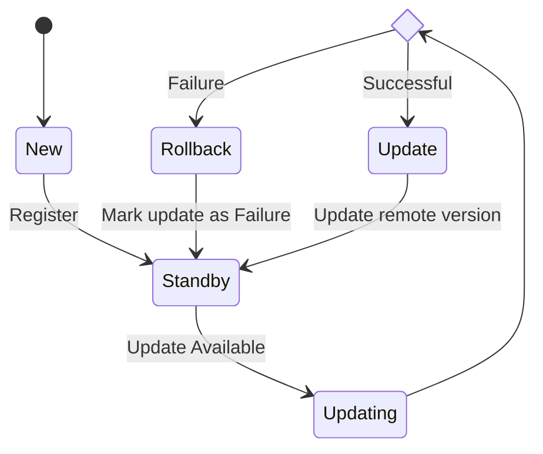

# Endpoints

The Lifecycle of an client is as following:

```mermaid
stateDiagram-v2
    state if_state <<choice>>
    [*] --> New

    New --> Standby: Register
    Standby --> Updating: Update Available
    Updating --> if_state
    if_state --> Update: Successful
    if_state --> Rollback: Failure
    Rollback --> Standby: Mark update as Failure
    Update --> Standby: Update remote version
```
