# Introduction to Yeet

Yeet is an PULL-based deployment server for Nix closures. Yeet only acts as an intermediary and does leave you open to choose your own nix cache and build-systems.

The indent of Yeet is to:

- Provide an easy way to manage your whole fleet of devices - from homelab to enterprise
- Not pose any restrictions onto how your nix derivation is built
- Allow for clients to be offline when the updates is created
- Secure defaults to protect your fleet

## Why do I want Yeet?

Wheter you are a person who manages their homelab server or an business which manages a large fleet of devices. Installing, configuring and maintaing your devices imperatively will bite you back in the long run.

Push based deployment system do work really well if you only deploy to servers. Once you also want to provision devices that may not be online this gets a whole more complicated. Now you have devices that miss updates, fly under the radar and clog up your pipelines.

This is where Yeet comes into play. By reversing the role with an on-device agent, the clients now signal to the server that they are ready to receiver their update.

This allows to offload the heavy lifting of the build process to build-machines. Especially in infrastractures that include hundreds of devices the savings get noticeable.

## Architecture

```mermaid
architecture-beta


    group clients[Fleet]

    service yeet-server(game-icons:catapult)[Yeet Server]

    service laptop(mdi:laptop)[Laptop] in clients
    service desktop(mdi:desktop-tower)[Desktop] in clients
    service server(mdi:server)[Server] in clients

    service cache(devicon:nixos)[Nix Cache]

    service source(logos:git-icon)[Fleet Definition]
    service build-machine(mdi:build)[Build Machine]
    service pipeline(logos:github-actions)[Build Pipeline]

    junction tl
    junction tlb
    junction tr
    junction trb
    source:B -- > T:pipeline
    pipeline:L -- R:tl
    build-machine:R -- R:tr
    pipeline:R --> L:build-machine
    tr:B -- T:trb
    tl:B -- T:tlb
    tlb:B --> T:yeet-server
    trb:B --> T:cache

    junction y_top
    y_top:B -- T:y_middle
    junction y_middle
    y_middle:B -- T:y_bottom
    junction y_bottom
    y_middle:L --> R:yeet-server

    laptop:L <-- R:y_top
    desktop:L <-- R:y_middle
    server:L <-- R:y_bottom


    junction c_top
    c_top:B -- T:c_middle
    junction c_middle
    c_middle:B -- T:c_bottom
    junction c_bottom
    c_middle:R -- L:cache

    laptop:R <-- L:c_top
    desktop:R <-- L:c_middle
    server:R <-- L:c_bottom
```

