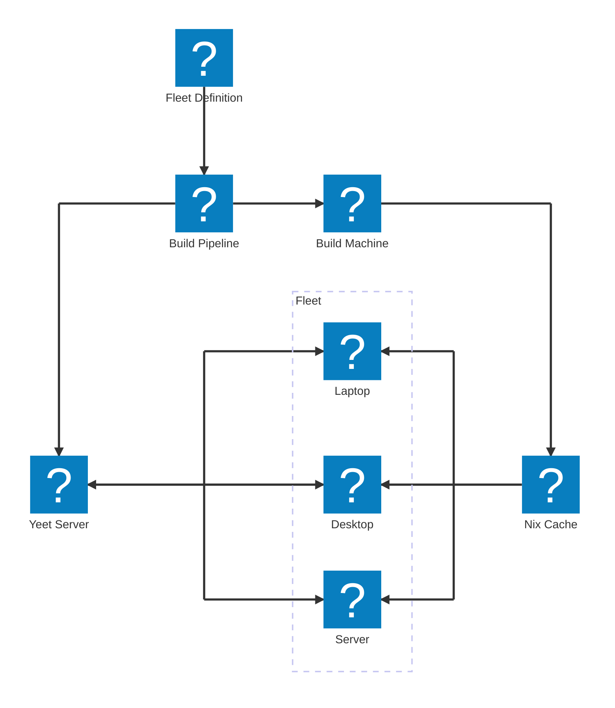

# Overview

```mermaid
architecture-beta


    group clients[Fleet]

    service yeet-server(game-icons:catapult)[Yeet Server]

    service laptop(mdi:laptop)[Laptop] in clients
    service desktop(mdi:desktop-tower)[Desktop] in clients
    service server(mdi:server)[Server] in clients

    service cache(devicon:nixos)[Nix Cache]

    service source(logos:git-icon)[Fleet Definition]
    service build-machine(mdi:build)[Build Machine]
    service pipeline(logos:github-actions)[Build Pipeline]

    junction tl
    junction tlb
    junction tr
    junction trb
    source:B -- > T:pipeline
    pipeline:L -- R:tl
    build-machine:R -- R:tr
    pipeline:R --> L:build-machine
    tr:B -- T:trb
    tl:B -- T:tlb
    tlb:B --> T:yeet-server
    trb:B --> T:cache

    junction y_top
    y_top:B -- T:y_middle
    junction y_middle
    y_middle:B -- T:y_bottom
    junction y_bottom
    y_middle:L --> R:yeet-server

    laptop:L <-- R:y_top
    desktop:L <-- R:y_middle
    server:L <-- R:y_bottom


    junction c_top
    c_top:B -- T:c_middle
    junction c_middle
    c_middle:B -- T:c_bottom
    junction c_bottom
    c_middle:R -- L:cache

    laptop:R <-- L:c_top
    desktop:R <-- L:c_middle
    server:R <-- L:c_bottom
```
